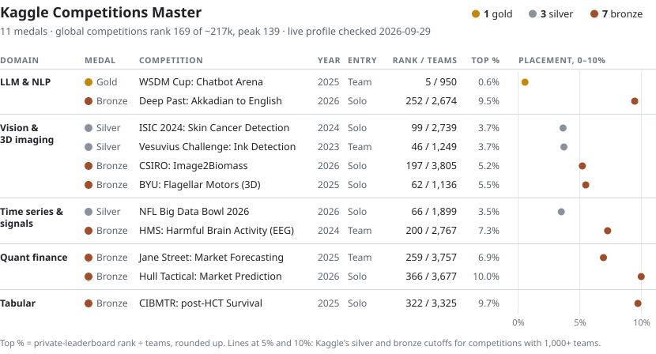

# Albert Wang

ML engineer working on LLM evaluation, inference and agent tooling.
Kaggle Competitions Master; team gold (5th of 950) for predicting which of two chatbot answers people prefer.

### Selected work

| Repo | What it is | Headline |
|---|---|---|
| [agent-fleet-ops](https://github.com/datahubber/agent-fleet-ops) | Case study: an ops layer that lets several autonomous LLM coding agents share scarce compute | Command guardrail: recall 0.982, precision 0.953 on a 446-command dev set of real agent commands |
| [wsdm-cup-5th-place-llm-judge](https://github.com/datahubber/wsdm-cup-5th-place-llm-judge) | Pairwise LLM judge for human preference (team of 5). I owned the vLLM inference behind a final submission and the uncertainty-gated post-processing, and wrote the public solution write-up | Gold, 5 / 950 |
| [hull-tactical-market-timing](https://github.com/datahubber/hull-tactical-market-timing) | Daily market-timing models and position sizing, rebuilt with purged walk-forward evaluation and no-lookahead tests | Solo bronze, 366 / 3,677 |

These repos were rebuilt in 2026 with AI coding agents working under my direction.

<!-- The board and the table below are generated from data/kaggle_medals.json by scripts/make_medal_board.py. -->
<!-- medal-board:start -->

<picture>
  <source media="(prefers-color-scheme: dark)" srcset="assets/medal-board-dark.svg">
  <source media="(prefers-color-scheme: light)" srcset="assets/medal-board-light.svg">
  
</picture>

<!-- medal-board:end -->

Medal table as text, with competition links

<!-- medal-table:start -->

| Domain | Competition | Medal | Rank / teams | Top % | Entry | Year | My contribution |
|---|---|---|--:|--:|---|--:|---|
| LLM &amp; NLP | [WSDM Cup: Chatbot Arena](https://www.kaggle.com/competitions/wsdm-cup-multilingual-chatbot-arena) · [repo](https://github.com/datahubber/wsdm-cup-5th-place-llm-judge) | Gold | 5&nbsp;/&nbsp;950 | 0.6% | Team | 2025 | Owned the inference notebook behind one of the two final submissions: vLLM serving of the fine-tuned Qwen2.5-14B judge on 2×T4, plus an uncertainty-gated post-processor. Wrote the public solution write-up and presented it at the winners' call. |
|  | [Deep Past: Akkadian to English](https://www.kaggle.com/competitions/deep-past-initiative-machine-translation) | Bronze | 252&nbsp;/&nbsp;2,674 | 9.5% | Solo | 2026 | Multi-candidate decoding and MBR reranking for ByT5 Akkadian-to-English translation, tuned through a logged ablation series. |
| Vision &amp; 3D imaging | [ISIC 2024: Skin Cancer Detection](https://www.kaggle.com/competitions/isic-2024-challenge) | Silver | 99&nbsp;/&nbsp;2,739 | 3.7% | Solo | 2024 | Final ensemble of three gradient-boosted tabular and image-model pipelines. |
|  | [Vesuvius Challenge: Ink Detection](https://www.kaggle.com/competitions/vesuvius-challenge-ink-detection) | Silver | 46&nbsp;/&nbsp;1,249 | 3.7% | Team | 2023 |  |
|  | [CSIRO: Image2Biomass](https://www.kaggle.com/competitions/csiro-biomass) | Bronze | 197&nbsp;/&nbsp;3,805 | 5.2% | Solo | 2026 | Re-weighted the SigLIP / DINOv3 model blend and added a mass-balance projection so the predicted biomass components stay consistent. |
|  | [BYU: Flagellar Motors (3D)](https://www.kaggle.com/competitions/byu-locating-bacterial-flagellar-motors-2025) | Bronze | 62&nbsp;/&nbsp;1,136 | 5.5% | Solo | 2025 |  |
| Time series &amp; signals | [NFL Big Data Bowl 2026](https://www.kaggle.com/competitions/nfl-big-data-bowl-2026-prediction) | Silver | 66&nbsp;/&nbsp;1,899 | 3.5% | Solo | 2026 |  |
|  | [HMS: Harmful Brain Activity (EEG)](https://www.kaggle.com/competitions/hms-harmful-brain-activity-classification) | Bronze | 200&nbsp;/&nbsp;2,767 | 7.3% | Team | 2024 |  |
| Quant finance | [Jane Street: Market Forecasting](https://www.kaggle.com/competitions/jane-street-real-time-market-data-forecasting) | Bronze | 259&nbsp;/&nbsp;3,757 | 6.9% | Team | 2025 |  |
|  | [Hull Tactical: Market Prediction](https://www.kaggle.com/competitions/hull-tactical-market-prediction) · [repo](https://github.com/datahubber/hull-tactical-market-timing) | Bronze | 366&nbsp;/&nbsp;3,677 | 10.0% | Solo | 2026 | Full pipeline: GRU, attention-GRU and MLP direction classifiers on leak-safe lag features, with percentile-calibrated leverage. |
| Tabular | [CIBMTR: post-HCT Survival](https://www.kaggle.com/competitions/equity-post-HCT-survival-predictions) | Bronze | 322&nbsp;/&nbsp;3,325 | 9.7% | Solo | 2025 |  |

<!-- medal-table:end -->

**Experience:** Senior ML engineer at Onity (since Sep 2025). Previously Microsoft CoreAI (Prompt Shields, 2025), Corning (ML engineer, computer vision, 2025) and Mass General Hospital (2024).

[Kaggle](https://www.kaggle.com/mianwang1024) · [Hugging Face](https://huggingface.co/AlbertWang8192) · [LinkedIn](https://www.linkedin.com/in/mianwang2026/) · [Medal certificates](https://github.com/datahubber/Certificates)
